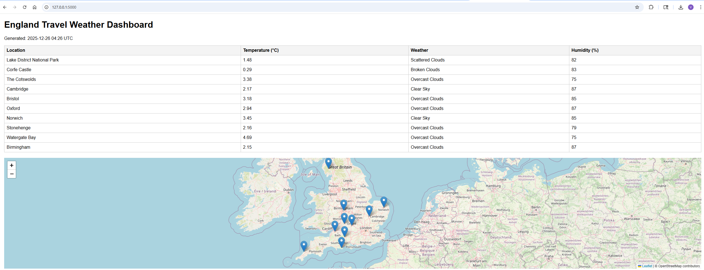

## **README.md**

````markdown
# England Travel Weather Dashboard

A web-based application that displays live weather data for 10 popular locations in England. The dashboard provides a table of temperature, weather description, and humidity, along with an interactive Leaflet map showing each location. Users can also download a PDF report of the dashboard.

---

## Features

- Live weather data from OpenWeatherMap API  
- Interactive table: Temperature (°C), Weather, Humidity (%)  
- Leaflet map with markers for each location  
- PDF export of the dashboard  
- Fully built with Python, Flask, HTML, and JavaScript  

---

## Locations Covered

1. Lake District National Park  
2. Corfe Castle  
3. The Cotswolds  
4. Cambridge  
5. Bristol  
6. Oxford  
7. Norwich  
8. Stonehenge  
9. Watergate Bay  
10. Birmingham  

---

## Setup & Installation

1. Clone the repository:

```bash
git clone <your-repo-url>
````

2. Navigate to the project folder:

```bash
cd england_weather_app
```

3. Create a virtual environment:

```bash
python -m venv venv
```

4. Activate the virtual environment:

```powershell
.\venv\Scripts\Activate.ps1
```

5. Install dependencies:

```bash
pip install -r requirements.txt
```

6. Set your OpenWeatherMap API key in PowerShell:

```powershell
$env:OWM_API_KEY="YOUR_API_KEY_HERE"
```

7. Run the application:

```bash
python app.py
```

8. Open your browser:

```
http://127.0.0.1:5000/
```

---

## Usage

* View live weather data for all locations
* Explore interactive Leaflet map
* Click **“Download PDF Report”** to generate a PDF of the dashboard

---

## Dependencies

* Python 3.11+
* Flask
* requests
* pdfkit
* wkhtmltopdf

---

## Screenshots

  <!-- Add your screenshot here -->

```

---